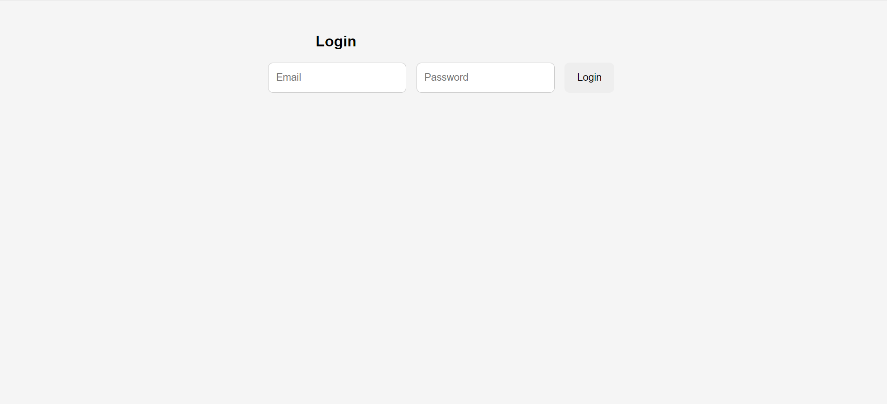
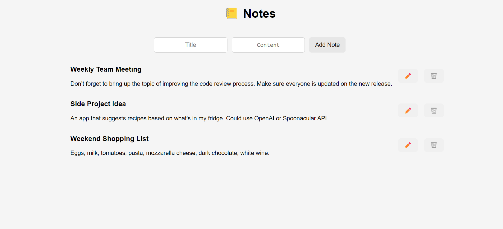

from pathlib import Path

# 📚 Notes App – Fullstack (FastAPI + React + PostgreSQL)

This is a fullstack project for a **Note-Taking App**, built using **FastAPI** on the backend and **React + Vite + TypeScript** on the frontend. The app supports user login via JWT and provides full CRUD capabilities for managing personal notes.

---

## 🌐 Live Architecture Overview

```
Frontend (Vite + React + TypeScript)
     |
     | REST API calls (JWT Auth)
     ↓
Backend (FastAPI)
     ↓
PostgreSQL (Database)
```

---

## 🧱 Monorepo Structure

```
notes-app/
├── backend/            # FastAPI + PostgreSQL
│   └── README.md       # Backend setup and API details
├── frontend/           # React + Vite + TypeScript
│   └── README.md       # Frontend setup and features
└── README_FULLSTACK.md # You're here (global project summary)
```

---

## ⚙️ Key Features

- 🔐 Token-based authentication using JWT
- 📝 Create, view, edit, and delete personal notes
- 🔁 RESTful API with protected routes
- 🧪 Backend tests with Pytest + HTTPX AsyncClient
- 🌐 CORS-enabled and ready for deployment

---

## 🌐 Live Demo Screenshots

| Login Page                           | Notes Page                           |
| ------------------------------------ | ------------------------------------ |
|  |  |

> All screenshots are located in: `frontend/src/assets`

---

## 🚀 Setup Instructions

### 1. Backend

See [📄 Backend README](./backend/README.md)

### 2. Frontend

See [📄 Frontend README](./frontend/README.md)

---

## 🧰 Tech Stack

- **Backend**: FastAPI, PostgreSQL, SQLAlchemy, Pydantic
- **Frontend**: React, Vite, TypeScript, React Router
- **Auth**: JWT (stored in localStorage)
- **Testing**: Pytest + httpx.AsyncClient

Built with ❤️ by Dolev Peretz
